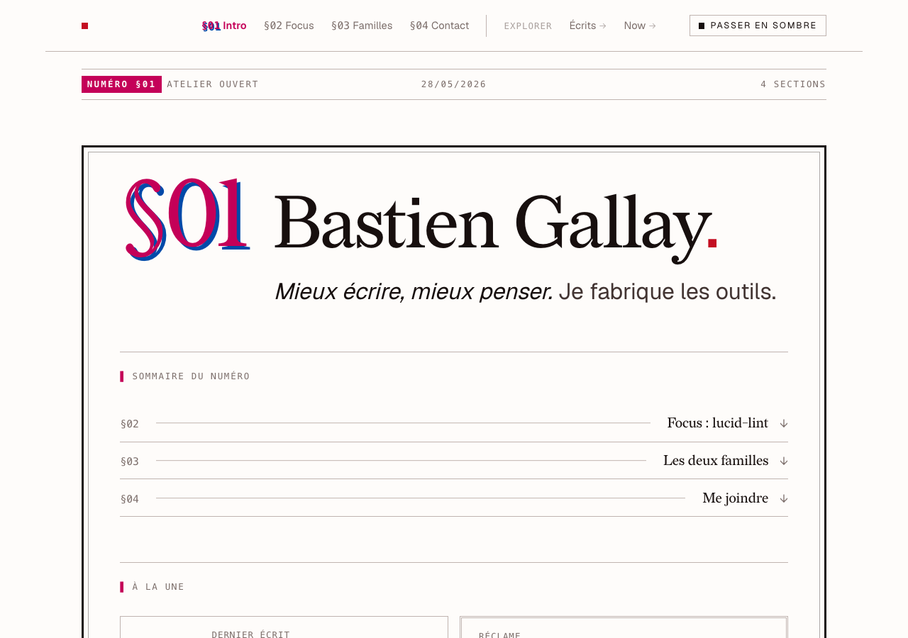

# bastiengallay.com

Site personnel pro de Bastien Gallay — en ligne sur [bastiengallay.com](https://bastiengallay.com).
Esthétique « vieux magazine » assumée (filets, réclames, numérotation
`§NN`, palette De Stijl mono-accent rouge, fontes Redaction + Geist),
plutôt qu'identité web générique. Détail dans [`.impeccable.md`](.impeccable.md).

**Statut** : en ligne, en itération. Hero, section écrits et `/now`
actifs ; pôles projets posés mais à étoffer. Stack
[Zola](https://www.getzola.org/) 0.22.1 (SSG Rust), templates Tera, Sass
compilé par Zola. Déploiement automatisé sur GitHub Pages à chaque push
sur `main` ([workflow](.github/workflows/deploy.yml)). Custom domain
`bastiengallay.com` (HTTPS), redirect actif depuis `bastiengallay.fr`.

## Où trouver quoi (pour Bastien-future qui revient dans 6 mois)

- **Écrits publiés** : [`/ecrits`](https://bastiengallay.com/ecrits/) sur
  le site (source canonique, listée par Zola).
- [`CLAUDE.md`](CLAUDE.md) — conventions, working language, garde-fous
  (worktree obligatoire, QA visuel primo-visiteur, etc.).
- [`.impeccable.md`](.impeccable.md) — design context, 5 design principles.
- [`brainstorm/`](brainstorm/) — décisions de cadrage horodatées (modèle
  umbrella, grouping, naming, choix de TLD). Premier doc :
  `20260513-homepage-oss.md`.
- [`.personal/TODO.md`](.personal/) — backlog actif (gitignoré).
- [`justfile`](justfile) — recettes dev (`just` pour lister, `just serve`
  pour `zola serve --drafts` sur port stable par checkout).
- **Relevé `/now`** — `data/constellation.toml` (ce que j'affirme, tenu à
  la main) et `data/activity.json` (ce qui est mesuré, généré). Un
  LaunchAgent quotidien commite et pousse le second. Recettes `just
  releve`, `just cron-status`, `just cron-log` ; détail et garde-fous
  dans [`CLAUDE.md`](CLAUDE.md).

## Prochaines décisions à prendre

- ~~Script de digest hebdo `daily-ops → /now` (la page est manuelle
  aujourd'hui).~~ **Tranché le 2026-07-26, autrement.** daily-ops
  enregistre l'intention, pas le résultat, et couvre des dépôts clients :
  il ne pouvait pas alimenter une page publique. `/now` est alimenté par
  un relevé git quotidien — voir « La relève de `/now` » dans
  [`CLAUDE.md`](CLAUDE.md).
- Alias email dédié au site (`bonjour@` ou `ecrire@bastiengallay.com`)
  pour remplacer `bastien@gallay.org` dans le footer.
- Régression visuelle CI (Argos-CI ou équivalent) quand le site
  grossit — note dans `.personal/TODO.md`.
