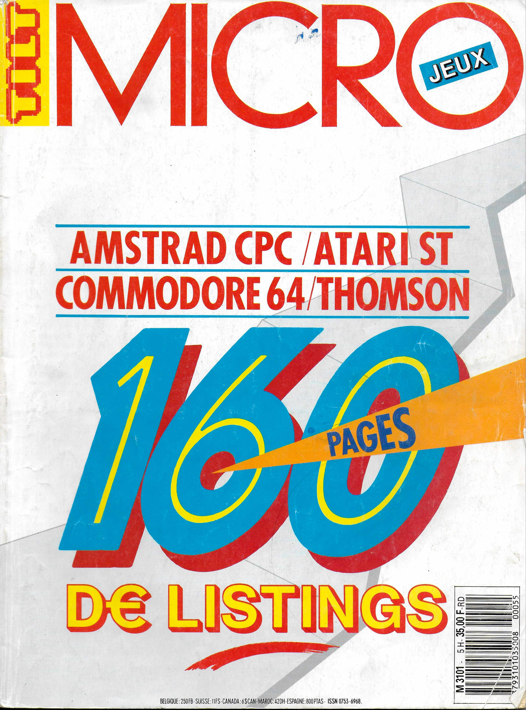
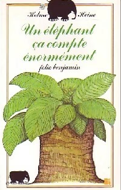

+++
title = "Pourquoi ce site, et pourquoi maintenant"
date = 2026-05-22
description = "D'un billard mal recopié sur Thomson TO9 à une discipline : pourquoi ce site existe."
draft = false

[extra]
numero = "01.10"
heading_html = "Pourquoi ce site, et pourquoi <mark class=\"mark\">maintenant</mark>"
signature_bio = "fabrique des outils OSS pour penser, écrire et coder comme une seule discipline."
+++

Un été, à 9 ou 10 ans, je tenais un hors-série du magazine *Tilt* avec
des listings en BASIC. J'ai encore la couverture en tête. Avec mon
frère, nous avons copié plusieurs pages de code sur notre
Thomson TO9. Par séances de trente minutes à une heure, l'un dictait et
relisait pendant que l'autre tapait ce programme que nous ne comprenions qu'à
moitié. On a fini par abandonner. Vers la fin des vacances, j'ai repris le
hors-série et j'ai terminé seul. J'ai enfin pu lancer le programme. La
forme du billard et quelques billes s'affichaient. Mais un grand trait au
milieu de l'écran montrait qu'il y avait eu des erreurs de recopie. Le jeu
ne répondait à rien.

<figure class="ecrit-figure">
  
  <figcaption class="fig-mark">FIG. 1 · Couverture <em>Tilt — Micro-Jeux</em>, HS 05, août 1987 · <a href="https://www.abandonware-magazines.org/affiche_mag.php?mag=28&amp;num=1013" rel="external">scan abandonware-magazines</a></figcaption>
</figure>

Patiemment, j'ai relu et comparé, me rendant compte que certains numéros de
ligne en BASIC avaient été décalés. Je démarrais le programme à nouveau,
voyant parfois un changement, parfois des erreurs de syntaxe nouvelles. J'ai
corrigé avec le listing. Il était plus fiable que mes
déductions. L'erreur venait de la transcription. Le programme, lui,
fonctionnait. La rentrée approchant, j'ai laissé tomber. Je n'avais plus
envie de revenir dessus.

Le décor de cet été-là s'était posé quelques années plus tôt.
J'apprenais à lire et à écrire
quand mes parents nous ont offert ce [Thomson TO9](https://fr.wikipedia.org/wiki/Thomson_TO9),
sur lequel j'ai découvert le BASIC. À cet âge, je pouvais lire tout seul *Un éléphant ça compte
énormément* d'Helme Heine. Je collais une étiquette en minuscules
cursives *garage de clarke*, et racontais *« Clarke a accéléré droit vers
le tremplin. Il a pris son envol et atterri de l'autre côté de la rivière.
Il avait échappé à l'avalanche. »* Je tapais à deux doigts des GOTO
infinis, un jeu *« nombre secret »* avec des IF/PRINT/INPUT. J'essayais de
dessiner un polygone avec POINT/LINE — il s'avérait mal fermé à l'affichage.

<figure class="ecrit-figure">
  
  <figcaption class="fig-mark">FIG. 2 · Helme Heine, <em>Un éléphant ça compte énormément</em>, Gallimard Jeunesse, coll. folio benjamin.</figcaption>
</figure>

Ce qu'un enfant ne pouvait pas deviner, c'était comment ces trois gestes
allaient n'en faire qu'un. Le code, la lecture, l'écriture : une seule
discipline.

Cette discipline est l'alignement de la pensée avec l'écrit.
J'en ai appris l'exigence par le code, mais elle dépasse le code. Ce site existe pour
incarner cette exigence, par des objets concrets : outils, écrits, prises
de position.

---


experiments/
├── ai
│   ├── assist
│   ├── audiobook-pipeline
│   ├── autopreneur
│   ├── bmad-context-viewer
│   ├── mercurai
│   ├── notebooklm-py
│   ├── rhetorix
│   └── SDD
├── autopreneur
│   └── voice-notes
├── games
│   ├── drop-escape-clone
│   ├── lab-doku
│   └── mdr-serious-game
├── lang-tools
│   ├── carbon
│   └── lean4
├── media
│   └── music-gen
└── misc

22 directories


J'ai l'habitude de tester la moindre idée qui me passe par la tête. Je
stocke ces expériences dans un dossier `experiments/`. Je le trie
systématiquement, impitoyablement : je compare chaque chantier 2 à 2. Seuls
les plus pertinents restent. C'est le *death-match* des prototypes pour gagner le
droit d'être promu au rang de projet. Et le prochain sur la ligne d'arrivée
est **[Rhetorix](https://rhetorix.lovable.app/)** : décrypter la rhétorique d'un article de presse.
En novembre 2025, pour ma recherche d'emploi, j'ai bricolé quelques scripts
et prompts. J'en ai extrait [inflecv](https://github.com/bastien-gallay/inflecv),
qui transforme une offre d'emploi en CV adapté. Toujours pour piloter
l'IA, [`/glance`](https://github.com/bastien-gallay/glance) formate les
retours IA pour les rendre simples à lire et à survoler. Pour vérifier qu'un projet
évolue dans le bon sens, [`/feature-torture`](https://github.com/bastien-gallay/feature-torture) est un banc de
dissection d'une fonctionnalité pour juger si elle survit, mute ou
disparaît. Jusqu'ici, j'ai créé pour m'amuser ou me faciliter la vie. J'ai
partagé afin de m'imposer un standard de qualité — la qualité minimum
pour ne pas m'en vouloir, dans quelques semaines ou quelques mois,
quand je voudrai reprendre le travail.
C'est de cette matière que naissent les billets qu'on lit ici.

Pourquoi tenir à ce soin-là en 2026 ? Face à des projets et créations
uniformes, l'impression que quelqu'un a repris, remanié et perfectionné
100 fois son travail me manque. Le danger
de la génération automatique n'est pas le remplacement pur et simple, mais
que notre contenu devienne indiscernable de celui de l'IA. Il y a un an, une
vidéo IA montrait 3 bras par personne. En 2026, la différence de forme entre les
contenus automatiques ou manuels s'amenuise. Quand je mets en pause
[`lucid-lint`](https://github.com/bastien-gallay/lucid-lint), `/feature-torture` ou un article, je veux être sûr
*qu'ils sont utilisables et que je pourrai les reprendre plus tard avec
plaisir*. Lorsque je les démarre, l'IA me sert à construire plus vite les
filets de sécurité, la documentation lisible, le suivi du projet. Demain
ou dans un an, je saurai où j'en suis sur chaque projet, et chaque projet
me racontera son histoire.

<!-- markdownlint-disable MD031 -->

$ lucid-lint check examples/sample.md
~~~~~ ⟨ • ⟩ ─────  lucid-lint  v0.2.0
                    cognitive accessibility linter · prose · EN / FR
                    ────────────────────────────────────────────────
warning  sample.md:3:1   Sentence is 29 words long (maximum 22).
warning  sample.md:46:1  Sentence has 4 commas (maximum 3).
info     sample.md:1:1   Kandel-Moles ease score 72.9 (target ≤ 9.0).

summary: 7 warnings, 1 info.

score: 50/100
        structure    ▓▓▓░░░░░░░░░░░░░░░░░   5/20
        rhythm       ▓▓▓▓▓▓▓▓▓▓▓▓▓▓▓▓▓▓▓▓  20/20
        lexicon      ▓▓▓▓▓▓░░░░░░░░░░░░░░  10/20
        syntax       ▓▓▓▓▓▓░░░░░░░░░░░░░░  10/20
        readability  ▓▓▓░░░░░░░░░░░░░░░░░   5/20
exit: 1

<!-- markdownlint-enable MD031 -->

Cet article est une première page. Les personnages sont présentés : des
expérimentations, des outils et des recherches. Je les mettrai en scène,
les ferai parler, au fil des chapitres à venir : certains conteront
l'échec d'un prototype ou l'excitation face à une idée prometteuse ;
parfois, vous suivrez un seul protagoniste de bout en bout ; enfin,
des séries analyseront les enjeux du code et de ce qu'on en fait. La table
des matières vous interpelle ? Écrivez-moi. Je prendrai le temps de vous
lire et de répondre.

<aside class="ours ours--cols" aria-label="Références et outils cités">
  

    
Références

    
FIG. 1 — <em>Tilt — Micro-Jeux</em>, hors-série n°5, août 1987, Éditions Mondiales. Scan : <a href="https://www.abandonware-magazines.org/affiche_mag.php?mag=28&amp;num=1013" rel="external">abandonware-magazines.org</a>.

    
FIG. 2 — Helme Heine, <em>Un éléphant ça compte énormément</em>, Gallimard Jeunesse, coll. folio benjamin.

    
Matériel — <a href="https://fr.wikipedia.org/wiki/Thomson_TO9" rel="external">Thomson TO9</a> (Wikipédia).

  

  

    
Outils cités

    
<a href="https://github.com/bastien-gallay/lucid-lint" rel="external">lucid-lint</a> — linter d'accessibilité cognitive pour la prose.

    
<a href="https://github.com/bastien-gallay/feature-torture" rel="external">/feature-torture</a> — banc de dissection pour une fonctionnalité.

    
<a href="https://github.com/bastien-gallay/glance" rel="external">/glance</a> — formater les retours IA pour la lecture-survol.

    
<a href="https://github.com/bastien-gallay/inflecv" rel="external">inflecv</a> — d'une offre d'emploi à un CV adapté.

    
<a href="https://rhetorix.lovable.app/" rel="external">Rhetorix</a> — prototype, décrypter la rhétorique d'un article de presse.

  

</aside>
